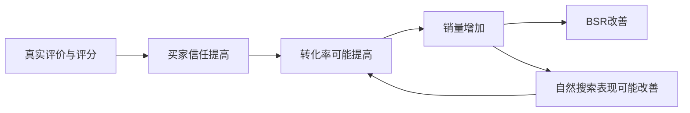

# 从无人问津到 BSR 头部：季节性产品爆发案例拆解

> [!summary] 核心结论
> 这款屋顶除雪耙的爆发，不是单靠广告、Coupon 或站外折扣，而是以下条件在同一时间形成闭环：
>
> **提前进入季节窗口 → 产品差异足够明确 → Listing 能承接转化 → 价格与促销集中放量 → 广告精准补位 → 库存与履约不断档 → 短期销量沉淀为自然流量。**
>
> 真正值得复制的是“先判断瓶颈，再组合运营动作”的方法，而不是机械照抄 `$179.99` 划线价、`$30 Coupon` 或 `55%` 站外折扣。

## 1. 案例一页看懂

![[assets/01-产品定位-目标用户-核心场景.png]]

| 项目    | 案例信息                                         | 运营意义                         |
| ----- | -------------------------------------------- | ---------------------------- |
| 产品    | 屋顶除雪耙（Snow Roof Rake）                        | 季节性、区域性、天气驱动型产品              |
| 产品定位  | 站在地面清理屋顶积雪及冰坝，降低屋顶受压风险                       | 解决“清雪慢”和“爬梯危险”两类强痛点          |
| 目标用户  | 美国多雪地区、有独立住宅、重视安全和效率的房主                      | 用户画像与场景清晰，利于关键词和图片聚焦         |
| 核心差异  | 36 英寸宽叶片、长杆、V 型结构、快速连接、折叠收纳                  | 参数可直接转化为效率、安全、适配性和收纳收益       |
| 常规售价  | 约 `$129.99`                                  | 高客单价，需要明显产品差异和充分信任背书         |
| 主要销售期 | 11 月至次年 2 月，12 月至 1 月为高峰                     | 旺季前必须完成上架、备货、Listing 和基础流量建设 |
| 案例结果  | 大类 BSR 约 175，小类排名到头部；文章所用工具预估 2 月销量 10,080 件 | 只能用于观察趋势，不能替代卖家后台实际数据        |

> [!warning] 数据边界
> - ASIN 被隐藏，销量、自然流量占比、转化率和广告占比主要来自第三方软件估算。
> - 上架时间在原文中同时出现 **2025-11-12** 和 **2025-11-25**，时间线存在冲突。
> - 月销量、流量结构和关键词转化率均不能视为卖家后台确认值。
> - 因此本案例适合学习运营逻辑，不适合作为精确的利润、广告归因或销量预测样本。

## 2. 销量与排名是怎样爬起来的

![[assets/02-月销量与BSR趋势.png]]

文章展示的第三方估算数据：

| 月份      |   预估销量 |        预估销售额 |      平均售价 | 阶段判断                      |
| ------- | -----: | -----------: | --------: | ------------------------- |
| 2025-11 |     10 |     `$1,800` | `$179.99` | 上架测试与初始冷启动                |
| 2025-12 |    307 |    `$38,461` | `$125.28` | 开始形成基础销量和自然排名             |
| 2026-01 |  1,671 |   `$217,213` | `$129.99` | Coupon、广告、天气及站外动作叠加，进入爬坡期 |
| 2026-02 | 10,080 | `$1,310,299` | `$129.99` | 第三方工具预估的爆发阶段              |

从图中可见的核心变化不是“某一天突然爆单”，而是：

1. 1 月上中旬 BSR 仍在约 2 万至 6 万区间波动；
2. 1 月 21 日之后日销逐步抬升，BSR 同步改善；
3. 1 月 28 日之后日销明显放大；
4. 2 月初日销维持在约 300—400 件的高位区间，BSR 稳定在头部。

> [!note] 正确看法
> BSR 是销量结果的相对排名，不是流量来源。BSR 变好可以说明销量速度增强，但不能直接证明是 Coupon、广告、站外或天气中的哪一个动作造成。

## 3. 案例操作时间线

![[assets/03-每日价格-Coupon-广告-BSR数据.png]]
根据文章及每日追踪表，可以还原出以下运营节奏：

| 时间          | 操作                            | 主要目的              | 需要验证的数据                    |
| ----------- | ----------------------------- | ----------------- | -------------------------- |
| 11 月下旬      | 上架，初始价格约 `$179.99`            | 建立价格与产品价值认知，开始冷启动 | Sessions、首单时间、首评时间、CTR、CVR |
| 12 月        | 价格逐步稳定至约 `$129.99`，开始获得自然订单   | 形成真实成交价和初始关键词权重   | 自然词、搜索词、类目排名、库存覆盖天数        |
| 1 月 14 日前后  | 新增 Sponsored Products 活动      | 对核心词和细分场景补充曝光     | 广告搜索词、CPC、广告 CVR、自然位变化     |
| 1 月 15—20 日 | 使用约 20% Coupon                | 测试优惠标签对点击和转化的刺激   | CTR、CVR、单件利润、Coupon 兑换销售额  |
| 1 月 21 日以后  | 使用约 `$30` Coupon，部分日期显示不同优惠形式 | 在需求上升期集中降低购买门槛    | 日销增量、BSR、自然单、优惠后利润         |
| 1 月 28—29 日 | 站外促销帖子出现                      | 短时间集中获取订单和流量      | 站外订单、折扣成本、退货、活动后自然单留存      |
| 2 月初        | BSR 和日销维持高位                   | 承接需求与排名红利         | 正常价格下 CVR、TACOS、自然词排名、库存风险 |

> [!important] 不能把时间先后当成因果
> 该阶段同时发生了天气变化、价格优惠、广告启动、站外推广、评论增长和库存变化。没有后台分渠道数据时，不能把全部增长归因于某一个动作。

## 4. 操作逻辑一：选对“会集中释放”的需求

这款产品并非普通季节性产品，而是同时具备：

- **季节性**：冬季需求远高于其他季节；
- **区域性**：订单集中在多雪地区；
- **紧急性**：暴雪后需求会从“计划购买”转为“立即购买”；
- **高痛点**：屋顶积雪可能造成损伤，爬梯清理又存在安全顾虑；
- **可预测＋突发**：冬季周期可预测，具体暴雪时间却具有突发性。

### 可迁移的选品判断公式

> **基础季节需求 × 突发事件强度 × 痛点紧急度 × 产品可交付能力**

| 产品类型 | 常规需求周期 | 外部触发因素 | 运营前置动作 |
|---|---|---|---|
| 风扇、降温产品 | 春夏 | 高温、热浪 | 提前入仓、关注区域天气和关键词趋势 |
| 防洪用品 | 雨季 | 暴雨、飓风 | 预留应急库存，避免需求来时无货 |
| 户外遮阳产品 | 春夏 | 高温、露营旺季 | 提前测试图片、价格和场景词 |
| 开学用品 | 7—9 月 | 各州开学时间 | 按地区和时间拆分需求节奏 |
| 节日装饰 | 节日前 | 节日临近、社媒热点 | 提前完成评价、关键词和库存建设 |

> [!tip]  对于季节性产品
> 对每个季节性 ASIN 建立“需求触发日历”，至少记录销售周期、区域、天气、节日、活动和最晚补货时间，而不是只看去年月销量。

## 5. 操作逻辑二：把产品参数翻译成用户收益

![[assets/05-五点描述卖点拆解.png]]

案例五点围绕以下五类价值展开：

| 产品结构/参数 | 用户痛点 | 用户收益 | Listing 中的表达重点 |
|---|---|---|---|
| 36 英寸宽叶片 | 普通窄雪耙需要反复操作 | 单次覆盖更多积雪，提高效率 | 不只写“36 Inches Wide”，还要写减少往返次数 |
| 长杆与地面操作 | 爬梯清雪不便且风险高 | 可在地面完成更多清理动作 | 场景图必须让用户直观看懂操作距离 |
| 耐低温材料 | 低温下材料可能开裂或变形 | 冬季使用更可靠 | 用测试温度、材料和结构证据支撑 |
| V 型叶片与可调长度 | 屋顶通风口、管道等固定障碍 | 更容易绕开障碍并控制清理范围 | 用结构对比图解释差异，不只写“专利” |
| 快速连接与折叠收纳 | 长杆组装、存放麻烦 | 便于组装、携带和收纳 | 展示拆装步骤及收纳后的真实尺寸 |

### 卖点表达公式

> **痛点 → 产品结构/参数 → 使用结果 → 场景 → 证据**

例如：

> 36 英寸宽叶片 → 单次覆盖面积更大 → 减少重复拉动 → 适合大面积屋顶 → 用对比图展示一次清理宽度。

### Listing 的正确分工

| 模块 | 核心任务 |
|---|---|
| 标题 | 定义产品是什么，覆盖核心品类词和关键规格 |
| 主图 | 在搜索结果页快速识别产品结构和尺寸差异 |
| 副图 | 解释痛点、场景、结构、证据、尺寸和收纳 |
| 五点 | 按消费者决策顺序消除疑虑，而不是堆关键词 |
| A+ | 展示品牌、对比、使用方式和更完整的信任信息 |
| 视频 | 降低“怎么组装、怎么使用、实际效果如何”的理解成本 |

> [!question] Listing 自检
> 用户在 10 秒内能否回答：
> 1. 这是什么产品？
> 2. 它解决什么问题？
> 3. 为什么比普通竞品更快或更安全？
> 4. 为什么值得 `$129.99`？

## 6. 操作逻辑三：价格、Coupon 与站外放量

### 6.1 价格锚点的真实作用

文章展示的价格路径大致为：

- 初始或参考价格约 `$179.99`；
- 常规成交价约 `$129.99`；
- Coupon 后最低约 `$99.99`；
- 站外活动使用更大折扣。

价格策略的意图是：

1. 常规价维持产品价值感；
2. Coupon 在搜索页或详情页强化“现在购买更划算”；
3. 固定金额优惠对高客单价商品更直观；
4. 在天气窗口集中促销，而不是全年低价；
5. 促销结束后恢复常规价，验证自然转化是否能够留存。

### 6.2 Coupon 不能只看 BSR

单件贡献利润必须重新核算：

```text
单件贡献利润
= 促销成交价
- 销售佣金
- FBA 配送费
- 产品成本
- 头程及关税
- Coupon/Deal 费用
- 单件广告成本
- 退货与售后摊销
```

美国站 Coupon 当前费用需要同时考虑：

```text
Coupon总成本
= 买家优惠金额
+ 每张Coupon固定费用 $5
+ 已兑换Coupon销售额 × 2.5%
```

### 6.3 站外放量的本质

![[assets/04-站外放量帖子.png]]

站外大折扣不是“免费获取流量”，而是用短期毛利购买：

- 订单集中度；
- 销量速度；
- 类目排名改善；
- 关键词销量信号；
- 更多关联或推荐曝光；
- 后续恢复价格时的自然单机会。

### 站外动作必须做三段复盘

| 阶段 | 必看数据 | 判断标准 |
|---|---|---|
| 放量前 | 日销、自然位、CVR、利润、库存 | 建立真实基准线 |
| 放量中 | 站外订单、折扣成本、异常订单、库存消耗 | 确认订单不是单纯低价套利 |
| 放量后 7—14 天 | 自然单、自然位、正常价 CVR、退货率、TACOS | 判断排名和流量是否真正留存 |


## 7. 操作逻辑四：关键词布局与自然流量

![[assets/06-关键词自然流量与转化率.png]]

第三方工具给出的关键词数据揭示了一个重要规律：**流量大不等于流量好，购买意图越具体，转化通常越稳定。**

| 关键词                      | 案例中的第三方转化率 | 意图判断                 | 运营动作                |
| ------------------------ | ---------: | -------------------- | ------------------- |
| `snow removal`           |    约 1.96% | 非常宽泛，可能包含多类除雪需求      | 低价探索，严格观察搜索词并否定无关流量 |
| `roof rake`              |    约 6.75% | 核心品类词，用户明确寻找屋顶雪耙     | 标题、广告和自然排名的重点词      |
| `roof rakes for snow`    |    约 6.25% | 高相关品类词               | 保持自然位，单独管理竞价        |
| `roof`                   |    无有效转化数据 | 过于宽泛，购买意图不明确         | 不应因流量大而高价抢位         |
| `roof snow removal tool` |    约 4.12% | 明确的问题解决型长尾词          | 用手动词组/精准测试          |
| `snow rake`              |   约 11.28% | 高转化核心词，但仍需辨别屋顶、汽车等场景 | 结合搜索词报告做精确否词        |

### 关键词分层

| 层级 | 示例 | 作用 |
|---|---|---|
| 核心品类词 | `roof rake`、`snow rake` | 定义产品归属，获得主要搜索流量 |
| 高意向长尾词 | `roof snow removal tool`、`long roof rake` | 流量较小但购买意图明确 |
| 规格词 | `36 inch roof rake`、`21 ft roof rake` | 承接明确比较需求 |
| 场景词 | `snow rake for roof`、`roof rake for solar panels` | 获取细分场景订单 |
| 宽泛探索词 | `snow removal` | 用于发现需求，不应无条件高竞价 |
| 无关词 | 汽车、车道等不匹配场景 | 及时否定，减少浪费 |

> [!note] 自然流量占比的正确理解
> 第三方工具显示的“自然流量占比”只能观察方向，不能代替后台数据。广告可能通过点击和转化帮助关键词建立历史表现，因此“广告订单占比低”不等于广告没有作用。

## 8. 操作逻辑五：广告在关键阶段精准补位

![[assets/07-Keepa趋势与新增广告节点.png]]

文章显示广告并非上架当天重投，而是在已有基础销量、Listing 和需求环境后启动。值得学习的是“广告补位”，不是“新品前期完全不开广告”。

### 更稳妥的 Sponsored Products 结构

| 广告类型    | 主要作用              | 该案例可借鉴的做法                   |
| ------- | ----------------- | --------------------------- |
| 自动投放    | 发现搜索词、ASIN 和季节性趋势 | 分开管理紧密、宽泛、同类、关联投放组          |
| 手动精准    | 承接已验证的核心词         | 对 `roof rake` 等核心词单独控制预算和竞价 |
| 手动词组/广泛 | 扩展长尾词             | 预算受控，定期把有效词转入精准             |
| 商品投放    | 获取竞品详情页流量         | 选择价格、评分、功能与本品具有竞争空间的 ASIN   |
| 否定投放    | 排除无效搜索词或商品        | 排除汽车除雪、车道雪铲等错误意图            |

### 广告优化顺序

1. 检查 Listing 是否完整、有 Featured Offer、库存和正常配送；
2. 判断词与产品是否真实相关；
3. 看 CTR，判断主图、价格、评分和优惠是否有吸引力；
4. 看 CVR，判断详情页和产品力是否能承接流量；
5. 看 CPC、ACOS 和 TACOS，决定竞价、预算和词的去留；
6. 看核心词自然位，判断广告是否在帮助形成自然订单。

> [!tip] 不要只追求低 ACOS
> 旺季爬坡期可以允许部分核心词 ACOS 较高，但必须同时观察总销售额、TACOS、自然订单、自然排名和单件利润。只有广告费增加、自然单没有改善时，才是真正的“烧广告”。

## 9. 操作逻辑六：库存、跟卖与履约稳定性

![[assets/08-Keepa深度解析汇总.png]]

第三方分析图还揭示了几个容易被忽视的运营条件：

### 9.1 FBA 断货时使用 FBM 维持可售

文章记录 12 月 13—14 日出现短暂 FBA 断货，期间仍有 FBM 在售。可学习的是：

- 旺季前准备 FBA 主库存；
- 保留少量 FBM 应急库存；
- 关注可售、预留、在途和入仓延迟；
- 放量前按峰值日销计算库存覆盖天数；
- FBA 断货时尽量避免 Listing 完全不可售。

```text
库存覆盖天数 = 可售库存 ÷ 预计日均销量
```

季节品至少需要三种预测：

- 正常日销情景；
- Coupon/广告放量情景；
- 极端天气或活动峰值情景。

### 9.2 跟卖防御不能只靠降价

文章显示出现 FBM 跟卖，但主卖家主要依靠 FBA 配送、Featured Offer 竞争力和产品差异维持销售。正确思路是：

1. 先核查跟卖是否合法、商品是否一致；
2. 保持库存、配送、账户绩效和价格竞争力；
3. 做好品牌、商标和供应链证据管理；
4. 不要把无底线降价作为唯一防御手段；
5. 记录 Featured Offer 丢失时间和原因。

### 9.3 类目定位保持稳定

产品持续聚焦 `Snow Rakes` 等正确类目，有利于系统理解商品属性。不要为了短期获得更好 BSR 数字而频繁跳入不准确类目。

## 10. 评论、销量、BSR 与自然排名的正确关系

文章把评论增长与 BSR 提升描述为正向循环。更严谨的链路是：



需要区分：

| 指标 | 含义 | 不能错误推导为 |
|---|---|---|
| 评论数量/评分 | 信任与产品反馈 | 评论会直接提高 BSR |
| BSR | 产品在类目中的相对销量表现 | BSR 好就一定有高自然搜索位 |
| 自然搜索排名 | 特定搜索词下的展示位置 | 自然位好就一定高利润 |
| 广告排名 | 竞价、相关性和广告表现共同影响 | 广告位高就代表自然权重高 |

Amazon 官方说明，BSR 由销量数据计算，近期销量权重高于较早销量；页面浏览量和客户评论不会直接影响 BSR。

## 11. 案例中真正可复制与不可复制的部分

### 可复制

- [x] 旺季前 1—2 个月完成上架、库存和 Listing 建设
- [x] 用核心规格解决明确痛点，而不是做弱差异
- [x] 把参数翻译成效率、安全、耐用和收纳收益
- [x] 关键词按核心词、场景词、规格词和宽泛词分层
- [x] 自动广告探索，手动广告承接，否定投放止损
- [x] 在需求窗口集中促销，而不是长期无目的降价
- [x] FBA 主库存＋FBM 应急库存
- [x] 用动作前后数据验证，而不是凭感觉判断

### 不可机械照抄

- [ ] 长期维持虚高划线价
- [ ] 未核算利润就开 `$30` Coupon
- [ ] 未检查叠加就同时开多种促销
- [ ] 使用 55% 站外折扣后只看 BSR
- [ ] 因案例后期开广告，就得出所有新品都应延迟广告
- [ ] 因自然流量占比高，就压缩全部广告预算
- [ ] 因短暂断货时排名没掉，就忽视断货风险
- [ ] 把第三方销量估算当作真实后台销量

## 12. 接管店铺后的 ASIN 诊断框架

### 12.1 先判断最大瓶颈

| 数据表现 | 首要判断 | 第一动作 |
|---|---|---|
| 曝光低、点击低 | 索引、类目、关键词覆盖、竞价或搜索需求不足 | 查搜索词相关性、索引、类目和广告覆盖 |
| 曝光高、CTR 低 | 主图、价格、评分、优惠展示弱 | 对比搜索结果页前三名竞品 |
| 点击高、CVR 低 | Listing、产品力、评价、价格或配送问题 | 先修转化，不要继续盲目加预算 |
| 广告有单、自然无单 | 自然排名尚未形成，或关键词布局不足 | 跟踪核心词自然位和 TACOS |
| 自然单下降 | 需求、竞品、价格、库存、Featured Offer 或排名变化 | 分模块排查，不要只调广告 |
| 订单增加、利润下降 | 促销、CPC、退货或成本透支利润 | 重算单件贡献利润和增量利润 |

### 12.2 每次操作都记录前后数据

| 日期 | 动作 | 售价 | 促销 | Sessions | CTR | CVR | 广告花费 | 广告销售额 | 总销售额 | ACOS | TACOS | 核心词自然位 | BSR | 可售库存 |
|---|---|---:|---|---:|---:|---:|---:|---:|---:|---:|---:|---:|---:|---:|
|  |  |  |  |  |  |  |  |  |  |  |  |  |  |  |

```text
CVR = 订单量 ÷ Sessions
ACOS = 广告花费 ÷ 广告销售额
TACOS = 广告花费 ÷ 总销售额
自然订单 ≈ 总订单 - 广告归因订单
促销增量利润 = 活动期实际利润 - 基准期预计利润
```

> [!warning] 控制变量
> 同一天同时大改主图、标题、价格、Coupon 和广告，后续几乎无法判断哪个动作有效。除紧急情况外，应分批修改并保留基准期。

## 13. 季节品运营 SOP

### 旺季前 8—12 周

- [ ] 确认销售周期、区域需求和天气/节日触发因素
- [ ] 分析核心竞品的价格、评分、规格、图片和差评痛点
- [ ] 完成核心词、场景词、规格词、竞品词分层
- [ ] 确认差异化能在主图和前两条五点中体现
- [ ] 建立常规价、最低成交价和促销利润模型
- [ ] 制定 FBA 主库存、FBM 应急库存和最晚补货时间
- [ ] 建立自动、手动关键词和商品投放基础结构

### 旺季前 4—8 周

- [ ] 获取首批真实订单和合规评价
- [ ] 根据搜索词报告收词、否词和调整竞价
- [ ] 修复高点击低转化问题
- [ ] 小范围测试常规售价、Coupon 或 Price Discount
- [ ] 跟踪核心词自然排名、CVR 和 TACOS
- [ ] 检查图片、视频、A+、尺寸和使用说明是否完整

### 需求爆发窗口

- [ ] 确认天气、节日或区域需求真实提升
- [ ] 检查参考价资格、促销叠加和最低成交价
- [ ] 把预算集中给已验证的关键词和商品目标
- [ ] 每日监控库存覆盖天数、Featured Offer 和配送时效
- [ ] 记录站外订单、促销成本和异常订单
- [ ] 不因 BSR 上升而忽视利润、退货和售后风险

### 活动结束后 7—14 天

- [ ] 恢复正常价格后检查 CVR 是否稳定
- [ ] 对比自然订单和核心词自然排名是否留存
- [ ] 计算真实增量利润，而不是只看销售额
- [ ] 检查退货率、差评和售后问题是否增加
- [ ] 清理只在超低价时转化的关键词和渠道
- [ ] 将成功条件和失败条件写入 ASIN 历史档案

## 14. 当前规则校正（美国站，截至 2026-07）

> [!important] List Price 与 Typical Price
> 自 **2026-04-23** 起，卖家提供的 List Price 需要具备近期外部零售依据，或买家曾在 Amazon 以该 Featured Offer 价格购买。自 **2026-05-18** 起，Typical Price 的计算进一步结合 90 天价格历史和促销销售情况。因此不能只为制造折扣感而长期填写没有依据的高参考价。

> [!important] Coupon 费用
> 美国站自 **2025-06-02** 起采用：每张 Coupon 固定费用 `$5`，另收已兑换 Coupon 销售额的 `2.5%`。该费用与卖家承担的买家折扣金额分开计算。

> [!important] 促销叠加
> Coupon、促销、价格折扣和社交媒体促销码可能产生叠加风险。创建活动前应核对叠加设置、预算和最低成交价，并在上线后检查前台结算结果。

> [!important] Sponsored Products 投放
> 商品推广包含自动投放、手动投放和否定投放。自动投放可用于发现搜索趋势和有效搜索词，手动投放用于集中控制已验证目标，否定投放用于减少无效流量和花费。

## 15. 最终学习结论

1. **爆款是系统结果，不是某一个广告技巧。**
2. **季节品必须提前进入市场，在需求峰值前完成基础建设。**
3. **参数只有翻译成用户收益，才能形成真正差异化。**
4. **流量大不等于流量好，关键词必须按购买意图分层。**
5. **促销是加速器，不是救命药；转化差时放量只会放大亏损。**
6. **广告不是自然流量的对立面，正确广告可以帮助自然订单形成。**
7. **库存和履约是爆发前提，销量起来后断货会破坏增长链路。**
8. **复盘必须区分相关性与因果性，并优先使用后台数据验证。**
9. **接管店铺后，先找当前最大瓶颈，再决定改 Listing、调广告、做促销还是补库存。**

> [!quote] 一句话总结
> 亚马逊运营不是不断增加动作，而是持续判断限制销量的最大瓶颈，并用可验证、可止损的动作解决它。

## 16. 资料来源

### 原始资料

- 微信公众号文章：<https://mp.weixin.qq.com/s/SPOvSLqTFEcB_dMWsGy-YA>
- 用户导出的 PDF：《从无人问津到 BSR 头部，这款产品做对了什么？》
- 本笔记 `assets` 文件夹内的 8 张图片均为用户提供的文章有效图片。

### Amazon 官方规则与说明

- Reference Pricing 更新：<https://sellercentral.amazon.com/seller-forums/discussions/t/f48a1fe5-aa8e-4806-b687-2d9aeec5c351>
- Coupon 与 Deal 费用更新：<https://sellercentral.amazon.com/seller-forums/discussions/t/05d936ee-b79d-451d-b03c-827df41df300>
- 促销、优惠券及折扣指南：<https://sell.amazon.com/blog/seller-promotions>
- Coupon 成本与叠加风险：<https://sell.amazon.com/blog/amazon-coupon-cost-budget>
- Sponsored Products 投放指南：<https://advertising.amazon.com/zh-cn/library/guides/targeting-with-sponsored-products>
- BSR 官方说明：<https://sell.amazon.com/zh/blog/amazon-best-sellers-rank>

## 关联笔记

- [[亚马逊季节性产品运营SOP]]
- [[亚马逊促销工具对比]]
- [[Sponsored Products广告结构]]
- [[ASIN运营历史档案模板]]
- [[亚马逊Listing转化诊断]]
- [[亚马逊库存覆盖天数与补货计划]]
