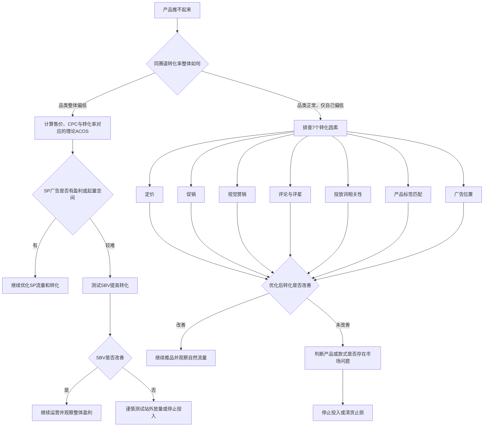

# 转化率才是广告破局的关键，别再被 ACOS 牵着走

> [!abstract] 文章主旨
> 很多卖家在产品推不动时，会把问题归因于 **CPC 太高、ACOS 太高**，于是不断压低竞价。但文章认为，判断一条链接是否值得继续投入，首先应看它能否获得达到同赛道水平的**转化率**。
>
> CPC 和 ACOS 是结果表现。真正需要追问的是：流量进入链接以后，产品有没有能力把这些流量转化成订单。

---

## 一、做链接诊断前

作者在为卖家进行链接诊断时，最常遇到的困惑集中在三个方面：

1. 这条链接是否还值得继续投入；
2. 值得投入时，应从哪里优化，需要继续投入多久；
3. 不值得继续投入时，剩余库存怎样处理才能降低损失。

因此，诊断链接不能只看某一个广告指标，而要先收集完整的运营信息，例如：

- 产品所处阶段；
- 售价与利润结构；
- 广告数据；
- 自然单与广告单表现；
- 关键词排名；
- Listing、评价和促销情况；
- 库存数量及库龄；
- 同赛道竞品表现。

只有把这些信息放在一起，才能判断问题究竟出在广告、Listing、产品竞争力，还是品类本身。

---

## 二、转化率才是推品的核心指标

### 1. 常见误区：ACOS 高就立即降低竞价

很多卖家看到 ACOS 较高时，第一反应是：

> CPC 太贵，应继续降低 bid，让广告先实现盈利。

文章认为，这种处理方式可能只改善表面数字，并不一定解决根本问题。竞价被强行压低后，可能出现以下变化：

- 广告位置下降；
- 获得的曝光减少；
- 精准流量占比降低；
- 点击者的购买意图变弱；
- 转化率下降；
- ACOS 最终不降反升。

因此，不能脱离流量质量和转化表现，单独判断 CPC 高低。

### 2. 原文广告案例

![[assets/高转化高ACOS广告案例.jpg]]

案例数据大致为：

| 指标 | 数据 |
|---|---:|
| 客单价 | 约 16 美元 |
| 点击量 | 32 |
| 广告订单 | 16 |
| 广告销售额 | 258.24 美元 |
| CPC | 4.02 美元 |
| ACOS | 49.81% |
| 整体广告转化率 | 约 50% |

虽然这组广告的 CPC 和 ACOS 都不低，但其点击到订单的转化能力很强，部分核心词的转化率约为 40%。

文章的判断是：

- 当前广告不是“没人买”，而是“买家愿意买，但获得点击的成本较高”；
- 说明关键词、流量和产品之间具有较强匹配度；
- 此时不能简单通过大幅降价或压低竞价破坏已有的高质量流量；
- 是否接受当前 ACOS，要结合推品阶段、利润、自然排名和整体链接收益判断。

> [!important] 文章的核心判断顺序
> **先看转化率是否成立，再分析 CPC 和 ACOS 是否能够被利润及后续自然流量承接。**

### 3. 为什么作者把转化率放在核心位置

文章认为，高转化意味着产品能够更有效地承接亚马逊分配的流量。持续获得订单后，关键词权重和自然流量才有机会得到提升。

因此，推品阶段不能只追求每一笔广告订单立即盈利，而应同时观察：

- 广告流量能否稳定成交；
- 核心词是否持续出单；
- 关键词自然排名是否前进；
- 自然订单占比是否增加；
- 链接整体是否逐步接近盈利。

但高转化也不等于可以无限亏损。最终仍要回到利润、库存和投入周期上判断。

---

## 三、转化率到底多高才算高

### 1. 转化率不能脱离品类孤立判断

20% 不一定高，5% 也不一定低。转化率会受到以下因素影响：

- 客单价；
- 标品或非标品属性；
- 品类购买决策难度；
- 产品使用场景；
- 消费者的比较成本；
- 同赛道产品的整体表现。

因此，文章建议把自己的转化率与**同赛道商品的主流水平**进行比较，而不是采用统一标准。

### 2. 如何确定真正的“同赛道竞品”

同赛道竞品不一定与自己的产品外观完全相同。文章以鹅颈款书灯为例，建议从以下维度寻找竞品：

- 解决相同的用户需求；
- 面向相同的使用场景；
- 目标受众相同；
- 价格带接近；
- 买家行为相似；
- 搜索流量重合度较高；
- 外观或产品形态具有可替代性。

这类产品才是消费者在购买时会真实对比的对象。

![[assets/同赛道商品综合转化率参考.png]]

### 3. 为什么用竞品综合转化率作参考

理想情况下，应把自己的广告转化率与竞品广告转化率直接比较。但市场上大部分竞品的广告后台数据无法获得，因此文章采用第三方工具提供的**综合转化率**作为可执行的参考。

文章提出一个经验规律：

- 除了大量站外放量的特殊链接外，头部链接的综合转化率往往高于广告转化率；
- 腰部和尾部链接，则可能出现广告转化率高于综合转化率的情况。

这一规律可以帮助卖家粗略判断自己的广告转化率是否达到同赛道水平，但应把它视为经验参考，而不是所有类目都固定成立的公式。

---

## 四、先判断是不是整个品类天然低转化

经过同赛道对比后，可能出现两种结果：

1. 整个品类的转化率都比较低；
2. 品类整体转化率正常，只有自己的产品偏低。

两种情况的处理逻辑完全不同。

### 1. 品类天然低转化时，ACOS 为什么容易爆表

文章给出的示例为：

| 指标 | 数据 |
|---|---:|
| 售价 | 24.99 美元 |
| CPC | 1.50 美元 |
| 转化率 | 5% |

在每个订单平均购买 1 件的简化情况下：

$$
ACOS \approx \frac{CPC}{售价\times 转化率}
$$

代入数据：

$$
ACOS \approx \frac{1.5}{24.99\times5\%}\approx120\%
$$

这意味着，只要售价、CPC 和转化率没有明显变化，即使广告操作本身没有严重错误，SP 广告也很难达到盈利状态。

因此，品类天然低转化会带来三个问题：

- 单个订单需要积累更多点击；
- 广告获客成本过高；
- 推动关键词排名需要更高预算。

文章由此强调：低转化、高 CPC、低客单价的组合，应在选品和立项阶段就重点评估。

### 2. 方法一：尝试以 SBV 提升流量承接能力

当 SP 广告难以撬动时，可以测试 SBV，通过视频更直接地展示：

- 产品功能；
- 使用方式；
- 适用场景；
- 与普通产品的差异；
- 买家最关心的痛点解决方式。

若 SBV 能取得更高的转化率，并让链接整体接近合理 ACOS 或整体盈利，则产品仍有继续运营的可能。

### 3. 方法二：利用站外流量积累初始订单

如果站内广告出单成本过高，文章建议考虑用较大折扣进行站外放量，以较低成本积累初始订单，再观察转化率、排名和活动资源是否改善。

作者的原始路径是：

> 站外折扣放量 → 积累订单 → 争取活动机会 → 配合广告继续放量 → 观察转化率和自然流量能否提升。

> [!warning] 使用边界
> 站外放量不能只看订单数量，还应考虑折扣后的亏损、流量质量、库存、参考价影响以及活动资格是否真实获得。它是一种测试和放量手段，不代表一定能改善链接。

---

## 五、品类转化正常，但自己的产品掉队怎么办

如果同赛道大部分产品转化正常，而自己的产品明显偏低，说明问题更可能来自自身链接。文章按以下 7 个维度逐项排查。

![[assets/影响转化率的7个因素.png]]

### 1. 定价是否具备市场竞争力

将产品与同赛道竞品比较，判断是否出现：

- 产品同质，但售价明显更高；
- 产品没有足够差异，却要求消费者支付溢价；
- 价格过低，反而让消费者怀疑质量；
- 到手价偏离该赛道主流价格带。

采购成本高、头程费用高属于卖家的内部成本，不能自动成为消费者接受高价的理由。售价必须有用户能够理解的价值作为支撑。

### 2. 促销是否具有足够吸引力

新品前期缺少评论和品牌优势，消费者选择新品的理由通常比较有限。促销可以降低首次尝试门槛。

制定促销时需要对比：

- 竞品日常售价；
- 竞品实际到手价；
- Coupon、价格折扣和 Deal 的展示情况；
- 自己促销后的价格是否进入有竞争力的区间；
- 折扣能否在搜索结果页被买家直接感知。

促销的目的不是单纯做低价，而是给消费者一个承担新品购买风险的理由。

### 3. 视觉营销是否做到位

文章把视觉营销视为影响点击与转化的基础因素，包括：

- 主图；
- 副图；
- 视频；
- 3D 模型；
- 场景展示；
- 功能演示；
- 产品细节与尺寸表达。

最直接的排查方法是，把自己的主图、副图和视频与同赛道销量较好的竞品逐项对比：

- 竞品表达了哪些信息；
- 自己缺失了哪些购买决策信息；
- 核心卖点是否足够直观；
- 图片是否解决了消费者的主要疑虑；
- 手机端首屏能否快速理解产品。

### 4. 评论数量和评星是否处于合理层级

文章给出了一组经验参考：

**评星参考：**

| 评星 | 作者给出的判断 |
|---|---|
| ＞4.8 | 优秀 |
| 4.5～4.8 | 良好 |
| 4.3～4.5 | 一般 |
| ＜4.3 | 较弱 |

**评论数参考：**

| 评论数 | 作者给出的层级 |
|---|---|
| ＞1000 | 第一层级 |
| 500～1000 | 第二层级 |
| 100～500 | 第三层级 |
| 30～100 | 第四层级 |
| 0～30 | 第五层级 |

这组数字适合帮助理解评价差距，但实际诊断时，更重要的是与目标关键词搜索结果页中的竞品分布比较。例如，同样是 4.4 星，在不同类目中的竞争力可能完全不同。

### 5. 广告投放词是否足够相关

文章分别提出了标品与非标品的判断思路：

- **标品：**观察搜索结果首页前部是否以同类产品为主；
- **非标品：**观察整个搜索结果首页中，同类商品和相似需求商品的比例。

排查时不能只看关键词文字是否包含产品名称，还要判断搜索该词的用户，是否真的在寻找自己的产品形态、功能、尺寸和使用场景。

相关性弱的词应降低投入或否定，避免大量无效点击拖低整体转化率。

### 6. 投放词下的产品标签是否匹配

即使关键词本身相关，自己的产品也可能不符合该词下买家的主流预期。

应对比搜索结果中的以下标签：

- 价格带；
- 品牌声量；
- 评论数量；
- 评星；
- 功能属性；
- 外观风格；
- 使用场景；
- 适用人群。

例如：

- 搜索结果首页主要是低价基础款，而自己的产品是高价升级款；
- 首页被知名品牌占据，消费者具有明显品牌偏好；
- 首页主流产品具备某项功能，而自己的产品缺失。

这时，问题不是关键词字面不相关，而是产品定位与该词下的消费预期不匹配。

### 7. 广告投放位置是否适配产品属性

文章给出以下经验规律：

#### 标品

- 市场主流价格带的标品：作者观察到 `TOS > ROS > PP` 的情况较多；
- 高客单价标品：可优先测试 SBV，其次测试 SP 商品投放中的同赛道 ASIN；
- 部分高价标品在关键词投放中的转化可能偏低。

#### 非标品

- 买家的审美和个人偏好影响更大；
- 作者观察到 ROS 位置可能表现较好，TOS 次之，商品页面较弱。

这些规律更适合作为测试方向。实际调整时，应查看自己的广告位报告，分别比较 TOS、ROS 和商品页面的 CPC、点击、订单、转化率及 ACOS，再决定是否增加位置系数。

---

## 六、七项排查都没有问题时，回到产品本身

如果价格、促销、视觉、评价、关键词、产品标签和广告位均没有发现明显问题，但转化率仍然明显落后，就要考虑：

- 产品款式是否不符合市场需求；
- 产品功能是否已经落后；
- 目标人群是否过小；
- 竞品是否拥有难以复制的优势；
- 同类款式中表现最好的产品是否也销量有限；
- 当前市场容量是否不足以支撑继续投入。

如果相似款中表现最好的竞品同样较弱，说明问题可能不是运营执行，而是产品或市场本身。此时继续追加广告预算，很可能只是扩大亏损。

应根据库存和利润情况，选择：

- 停止继续补货；
- 收缩广告预算；
- 降价或促销清货；
- 将预算转移到更有潜力的产品；
- 复盘选品阶段遗漏的数据。

---

## 七、文章完整诊断逻辑

---

## 八、文章结论

文章最终想表达的不是“ACOS 不重要”，而是：

> **不要只根据 CPC 和 ACOS 的表面数字做广告决策，应先判断转化率是否达到同赛道水平，再区分是品类问题、链接问题还是产品问题。**

完整思路可以概括为：

1. 收集链接完整数据，不根据单一指标下结论；
2. 判断广告是否具有真实转化能力；
3. 将转化率与同赛道商品比较；
4. 品类天然低转化时，评估商业模型是否成立；
5. 只有自己低转化时，按照 7 个维度排查；
6. 优化后仍无改善，则重新评估产品和市场；
7. 产品不值得继续投入时，及时清货止损。

> [!summary] 一句话总结
> **广告破局的起点不是机械压低 ACOS，而是先确认产品能不能把流量转化为订单；只有转化成立，后续竞价、排名、自然流量和利润优化才有基础。**
