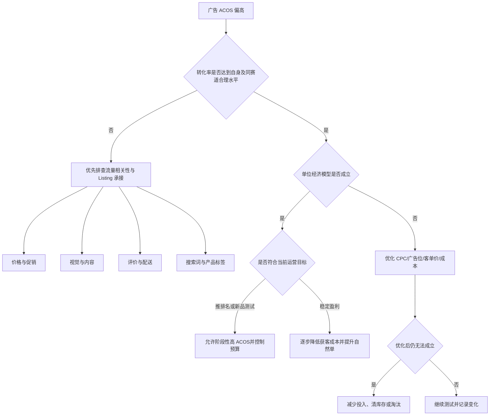

# 转化率与 ACOS：亚马逊广告诊断与优化框架

> [!abstract] 核心结论
> **ACOS 是结果指标，不是问题本身。** 广告优化不能只靠压低竞价，而应同时判断：流量是否精准、Listing 是否能承接流量、广告位是否适配、产品单位经济模型是否成立。
>
> 转化率很重要，但它也不是唯一指标。正确顺序是：**先判断流量质量与转化能力，再判断 CPC 和利润能否匹配。**

## 一、先理解 4 个核心指标

| 指标 | 公式 | 主要反映 |
|---|---|---|
| CTR | 点击量 ÷ 曝光量 | 广告素材、主图、价格和搜索词是否能吸引点击 |
| CVR | 订单量 ÷ 点击量 | 流量进入详情页后是否愿意购买 |
| CPC | 广告花费 ÷ 点击量 | 获得一次点击的平均成本 |
| ACOS | 广告花费 ÷ 广告销售额 | 广告销售额中有多少比例被广告花费占用 |

在“每个广告订单平均只购买 1 件、客单价变化不大”的简化条件下：

$$
ACOS \approx \frac{CPC}{客单价 \times CVR}
$$

因此，ACOS 由三个核心变量共同决定：

1. 点击成本 CPC；
2. 广告转化率 CVR；
3. 广告订单客单价。

> [!example] 计算示例
> 售价为 24.99 美元，CPC 为 1.50 美元，广告转化率为 5%：
>
> $$
> ACOS \approx \frac{1.50}{24.99 \times 5\%} \approx 120\%
> $$
>
> 这说明即使广告流量完全正常，只要类目 CPC 高、产品售价低、转化率又有限，广告也可能天然难以盈利。

### 三个反推公式

**可承受 CPC：**

$$
最高CPC \approx 客单价 \times CVR \times 目标ACOS
$$

**达到目标 ACOS 所需的最低转化率：**

$$
最低CVR \approx \frac{CPC}{客单价 \times 目标ACOS}
$$

**盈亏平衡 ACOS：**

$$
盈亏平衡ACOS = \frac{售价-产品及履约等变动成本}{售价}
$$

变动成本通常包括采购成本、头程分摊、FBA 配送费、佣金、促销折扣、退货损耗等。实际管理中，应先计算盈亏平衡 ACOS，再设置可接受的目标 ACOS。

---

## 二、为什么不能看到高 ACOS 就立刻压竞价

![[assets/广告数据示例-高转化高ACOS.jpg]]

原文案例中，广告共获得 32 次点击、16 个订单，广告转化率约为 50%，但 ACOS 接近 50%。这类数据说明：

- 流量与详情页承接能力较强；
- 高 ACOS 主要可能来自 CPC、售价、利润空间或广告位成本；
- 这不一定是一组“应该立刻关闭”的广告。

盲目降低竞价可能带来以下连锁反应：

1. 广告位下降；
2. 曝光量和点击量减少；
3. 搜索词或广告位流量结构发生变化；
4. 高质量流量占比下降；
5. 转化率下降，ACOS 未必同步改善。

> [!warning] 不要把“高转化”理解为可以无限接受亏损
> 高转化只能证明流量与页面匹配度较好，不能证明单位经济模型成立。是否继续投放，仍要结合毛利、自然单增长、关键词排名、库存周期和产品生命周期判断。

---

## 三、转化率多少才算合格

不存在适用于所有产品的固定转化率标准。判断转化率时，应优先使用以下四类基准。

### 1. 与产品自身历史数据对比

对比同一 ASIN 在相似价格、库存、促销、评价和季节条件下的历史 CVR，判断近期是否出现异常下降。

### 2. 与不同流量来源对比

将转化率拆分到以下层级：

- 广告活动；
- 广告组；
- 搜索词或投放目标；
- 匹配方式；
- 广告位；
- 品牌词、核心品类词、长尾词；
- SP、SB、SBV、SD 等广告形式。

整体转化率正常，不代表每个搜索词都正常；整体转化率偏低，也可能只是某一批宽泛流量拖累。

### 3. 与同赛道产品对比

真正的竞品不一定外观完全相同，而应在以下维度与自己的产品高度重合：

- 解决相同需求；
- 使用场景相同；
- 目标人群相同；
- 价格带相近；
- 功能和规格接近；
- 搜索流量重合度较高。

![[assets/同赛道商品综合转化率参考.png]]

第三方工具提供的竞品转化率适合做方向性参考，但不能替代自己的广告报告，因为第三方数据可能是估算值，且“综合转化率”与“广告转化率”口径并不相同。

### 4. 与理论盈亏要求对比

即使 CVR 高于竞品，只要仍低于当前 CPC 和目标 ACOS 所要求的最低 CVR，广告依然无法盈利。因此应同时判断：

- 市场层面：转化率是否具有竞争力；
- 财务层面：转化率是否足以支撑当前点击成本。

> [!tip] 样本量判断
> 不要只凭几次点击做结论。可先用 `1 ÷ 预期转化率` 粗略估算获得 1 单所需点击量，再至少观察多个预期订单周期。
>
> 例如，预期 CVR 为 10%，理论上平均约 10 次点击产生 1 单；只有 5 次点击时，不适合直接判定搜索词无效。

---

## 四、广告数据诊断矩阵

| CTR | CVR | 常见含义 | 优先检查 |
|---|---|---|---|
| 高 | 高 | 流量与页面匹配较好 | CPC、售价、毛利、预算和扩量空间 |
| 高 | 低 | 广告能吸引点击，但页面不能完成成交 | 价格、促销、评价、图片、卖点、变体、配送时效 |
| 低 | 高 | 流量少但进入页面的人购买意愿强 | 主图、标题、价格展示、广告位、竞价和曝光量 |
| 低 | 低 | 流量相关性或产品竞争力可能较弱 | 搜索词、投放对象、产品定位、Listing、市场需求 |

### 高转化、高 ACOS

处理重点：

- 计算盈亏平衡 ACOS；
- 检查高 CPC 是否集中在某个广告位或搜索词；
- 分离品牌词、核心词和探索词；
- 调整竞价，而不是统一下调；
- 判断广告是否推动自然排名和自然订单；
- 尝试提高客单价、组合装或利润率。

### 低转化、高 ACOS

处理重点：

- 先否定无关或弱相关流量；
- 检查搜索结果页中的价格、评价、功能和品牌标签是否错位；
- 优化 Listing 和 Offer；
- 在转化问题未解决前限制预算扩张。

### 高转化、低曝光

处理重点：

- 检查竞价与预算是否不足；
- 检查广告是否经常失去展示机会；
- 扩展高相关长尾词和 ASIN 定投；
- 测试不同广告位和匹配方式。

---

## 五、转化率下降的 7 个排查维度

![[assets/影响转化率的7个因素.png]]

### 1. 定价是否具有竞争力

对比同赛道竞品的实际成交价，而不是只看划线价或标价。重点检查：

- 同质产品是否明显低价；
- 自己的溢价是否有功能、材质、品牌或服务支撑；
- 低价是否反而造成质量疑虑；
- 价格是否偏离目标人群的接受范围；
- 配送时效、运费和到手价是否有劣势。

内部采购成本、头程运费高，不会自动转化成消费者愿意支付的溢价。

### 2. 促销是否有吸引力

促销的作用是降低首次购买门槛，而不是长期掩盖产品竞争力不足。检查：

- Coupon、价格折扣或活动标签是否在搜索结果页可见；
- 折扣后到手价是否进入主流价格带；
- 新品缺少评价时，是否给出了足够的首次购买理由；
- 促销是否破坏参考价、利润或后续活动空间；
- 促销结束后，转化率能否维持。

### 3. 视觉营销与 Listing 是否能够承接流量

依次检查：

- 主图是否快速表达产品形态和核心差异；
- 副图是否覆盖尺寸、功能、使用场景、兼容性和痛点；
- 视频是否展示真实使用过程；
- 标题和五点是否与广告搜索词一致；
- A+ 是否帮助解释复杂功能；
- 变体关系是否清晰，默认子体是否合适；
- 移动端首屏是否能够完成主要说服。

最有效的优化方法之一，是将自己的主图、副图、视频和同赛道头部竞品逐张对比，明确缺失信息，而不是只判断“图片是否好看”。

### 4. 评价与社会证明是否处于竞争区间

不要使用统一的“多少条评论才合格”标准，应与目标搜索词首页的竞品分布比较：

- 平均评星；
- 评论数量；
- 近期评论增长；
- 差评集中问题；
- 图片和视频评论；
- 评价内容是否直接反驳买家顾虑。

同样的 4.3 星，在评价普遍较低的类目可能仍有竞争力；在首页普遍 4.6 星以上的类目，则可能明显影响转化。

### 5. 广告搜索词或投放对象是否精准

判断相关性不能只看词面是否相似，还要判断购买意图是否一致。

检查内容包括：

- 搜索该词时，首页是否以同类产品为主；
- 用户输入该词时，是否真的希望购买自己的产品形态；
- 词义是否过宽；
- 规格、尺寸、材质、功能、适用人群是否匹配；
- ASIN 定投对象是否与自己的产品存在替代关系。

### 6. 搜索结果页中的产品标签是否匹配

即使搜索词相关，产品也可能因市场定位错位而难以转化。重点对比：

- 价格带；
- 品牌认知；
- 评论量级；
- 主流功能；
- 外观风格；
- 使用场景；
- 目标人群；
- 配送时效和促销标签。

例如：搜索结果页以低价基础款为主，而自己的产品是高价升级款，此时问题不一定是关键词不相关，而可能是该词下的主流购买预期与产品定位不匹配。

### 7. 广告位与广告形式是否适配

TOS、ROS、商品页面等广告位的转化表现没有适用于所有类目的固定排序。正确方法是：

1. 查看广告位报告；
2. 分别计算各广告位的 CPC、CTR、CVR、ACOS 和订单量；
3. 同时观察数据量，避免被少量订单误导；
4. 只对表现稳定的广告位增加调整系数；
5. 将高价产品、强视觉产品、对比型产品分别测试 SP、SBV 和商品投放。

> [!important] 文章中的广告位规律只能当作测试假设
> “标品一定 TOS 最好”“非标品一定 ROS 最好”不是通用结论。广告位效果会受价格、品牌、评论、搜索词意图、竞品结构和页面质量影响，必须以自己的广告位报告为准。

---

## 六、SP 难以盈利时，是否应该改投 SBV 或站外

### SBV 适合的情况

SBV 更适合具备以下特征的产品：

- 使用方式需要演示；
- 产品差异点难以用静态主图表达；
- 有明显场景感；
- 视频能够快速解决买家疑问；
- 核心词竞争激烈，需要新的展示形式。

但 SBV 不是天然低 ACOS。视频质量、关键词相关性、着陆页面和品牌资产不足时，SBV 同样可能低转化。

### 站外放量适合的情况

站外大折扣本质上是用利润换取订单速度和库存周转，适合：

- 新品需要快速积累初始订单；
- 库存压力较大；
- 站内获客成本显著高于站外成本；
- 产品具有较强价格弹性；
- 能接受折扣对利润和价格体系的影响。

使用前必须评估：

- 折扣后的单件贡献利润；
- 库存和补货能力；
- 站外流量是否与目标用户匹配；
- 是否会造成低质量订单、退货或评价风险；
- 对参考价、后续促销和品牌定位的影响。

> [!warning] 站外放量不是活动资格保证
> 销量增长可能改善链接数据，但不能把站外出单理解为必然获得 BD、Deal 或其他活动资格。活动资格还取决于平台规则、价格历史、库存、评价、账户状态和系统邀请等因素。

---

## 七、广告优化的标准操作流程

### Step 1：明确广告目标

不同阶段不能用同一套 ACOS 标准：

| 阶段 | 主要目标 | 关注重点 |
|---|---|---|
| 新品测试 | 验证需求和关键词 | CTR、CVR、搜索词、页面问题 |
| 推排名 | 获取有效订单和排名信号 | 核心词订单量、自然排名、总 ACOS |
| 稳定盈利 | 控制获客成本 | 目标 ACOS、TACOS、利润、自然单占比 |
| 清库存 | 提高周转、减少仓储损失 | 售罄速度、单件回款、广告花费上限 |

### Step 2：计算利润边界

至少计算：

- 盈亏平衡 ACOS；
- 目标 ACOS；
- 当前 CVR 下的最高 CPC；
- 当前 CPC 下所需最低 CVR；
- 每售出一件可接受的广告成本。

### Step 3：按层级拆分数据

拆分顺序建议：

1. 广告组合；
2. 广告活动；
3. 广告组；
4. 投放目标；
5. 搜索词；
6. 匹配方式；
7. 广告位；
8. 日期与促销阶段。

### Step 4：先处理结构性问题

优先处理：

- 无关流量；
- Listing 明显缺陷；
- 价格和促销失去竞争力；
- 变体、库存、配送和购物车异常；
- 大量点击无订单的搜索词；
- 明显不适配的商品投放对象。

### Step 5：再调整竞价和预算

竞价调整应尽量精细化：

- 高转化高 CPC：小幅调整，观察广告位变化；
- 高转化低曝光：适度加价或提高预算；
- 低转化高花费：降价、暂停或否定；
- 新词探索：独立预算，限制风险；
- 成熟词：单独建活动，稳定竞价和预算。

### Step 6：一次只测试一个主要变量

例如：

- 只改主图，不同时大幅改价；
- 只调整广告位加价，不同时更换大量关键词；
- 只测试一种促销方式；
- 记录调整时间，至少观察一个完整购买周期。

### Step 7：判断产品是否值得继续投入

当以下问题长期存在时，应考虑止损：

- 同赛道需求本身较弱；
- 产品款式或功能缺乏竞争力；
- 即使达到类目正常 CVR，单位经济模型仍不成立；
- 核心差评问题无法通过 Listing 或轻微改款解决；
- 广告、促销、视觉和价格均优化后仍持续低转化；
- 库存成本和机会成本高于继续运营的潜在收益。

---

## 八、常见误区

### 误区 1：ACOS 高就是 CPC 太高

ACOS 高也可能是转化率低、客单价低、流量不精准或利润模型不成立。

### 误区 2：压低竞价一定能降低 ACOS

竞价下降可能导致广告位和流量结构变化，最终 CVR 下降，ACOS 未必改善。

### 误区 3：转化率越高越好，不用考虑利润

转化率只反映成交效率。高转化、低毛利、高 CPC 的广告仍可能持续亏损。

### 误区 4：存在统一的合格转化率

转化率必须结合类目、价格、搜索词、广告位、产品阶段和利润目标判断。

### 误区 5：竞品综合转化率等于广告转化率

两者统计口径不同，只能做辅助判断，不能直接一一对标。

### 误区 6：某种广告位对某类产品一定最好

广告位规律只能用于提出测试假设，最终结论必须来自自己的广告位报告。

### 误区 7：广告数据不好，问题一定在广告

广告只是流量入口。产品、定价、Listing、评价、库存、配送和市场需求都会影响结果。

---

## 九、可直接使用的诊断清单

### 广告层面

- [ ] CTR 是否低于自身历史水平？
- [ ] CVR 是否低于自身历史和同赛道参考？
- [ ] 高花费是否集中在少数搜索词？
- [ ] 搜索词购买意图是否与产品一致？
- [ ] 各广告位的 CPC、CVR、ACOS 是否存在明显差异？
- [ ] 自动广告和广泛匹配是否持续引入无关流量？
- [ ] 高转化词是否独立建活动并获得稳定预算？

### Listing 与 Offer 层面

- [ ] 到手价是否具有竞争力？
- [ ] 促销标签是否清晰可见？
- [ ] 主图是否能快速表达差异点？
- [ ] 副图是否解释尺寸、功能、兼容性和使用场景？
- [ ] 标题、五点和广告搜索词是否一致？
- [ ] 评星和评论量是否落后于目标搜索词首页？
- [ ] 配送时效、库存和购物车是否正常？

### 财务层面

- [ ] 盈亏平衡 ACOS 是多少？
- [ ] 目标 ACOS 是否考虑自然单和产品阶段？
- [ ] 当前 CVR 能承受的最高 CPC 是多少？
- [ ] 当前 CPC 要求的最低 CVR 是多少？
- [ ] 每增加 1 单广告订单，实际贡献利润是多少？
- [ ] 继续投放的机会成本是否高于清货或淘汰？

---

## 十、最终判断框架

> [!summary] 运营判断顺序
> **先看流量是否精准 → 再看页面能否转化 → 再看 CPC 与利润是否匹配 → 最后决定扩量、控量或止损。**
